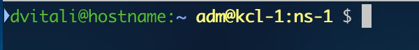
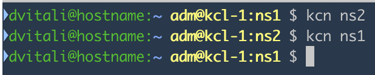

# kube-tools

A collection of tools to work with Kubernetes

## kube-ps1

A super simple command to display a string that you can easily put in your PS1 prompt.
The output is usually used in your prompt as follows:



## kcn

Simple utility to switch between namespaces



```bash
$ kcn ns1 # Switches to ns1
```
