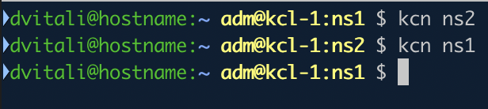

# kube-tools

A collection of tools to work with Kubernetes

## kube-ps1

A super simple command to display a string that you can easily put in your PS1 prompt.
The output is usually used in your prompt as follows:


### Usage

Depending on what and how you want your prompt look like,
put the following in your `~/.zshrc` / `~/.bashrc`:

```bash
PS1='%{$fg[green]%}%n@%m:%{$fg_bold[blue]%}%2~ %{$fg[yellow]$(kube-ps1) %}$(git_prompt_info)%{$reset_color%}%(!.#.$) '
```

Basically, call `$(kube-ps1)` in your prompt and enjoy!


## kcn

Simple utility to switch between namespaces





### Usage

```bash
$ kcn ns1 # Switches to ns1
```
